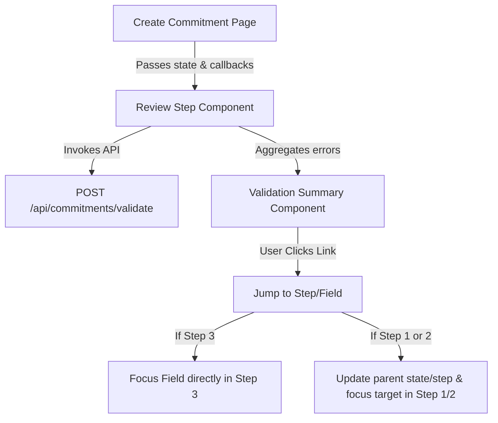

# Review Step Validation Summary and Jump-to-Error

## Overview

The **Review Step Validation Summary** aggregates all client-side checks and server-side validation results (fetched from `/api/commitments/validate`) on the final wizard step (Step 3: Review & Confirm). It provides a unified list of errors that prevents user submission until resolved, and allows users to jump back directly to the offending fields for quick correction.

---

## Architecture & Integration

### 1. Unified Validation Source
Validation runs automatically inside `CreateCommitmentStepReview.tsx` using a React `useEffect` hook. It triggers when:
- The wallet connection status changes.
- Review checkboxes (terms, risks) toggle.
- Primary parameters (`amount`, `asset`, `durationDays`, `maxLossPercent`) change.

### 2. Validation Checks

#### Client-side (Step 3 specific)
- **Wallet Connection**: Verifies that the Freighter wallet is connected and has a valid address.
- **Terms & Conditions**: Ensures the user checked the terms checkbox.
- **Risks Acknowledgment**: Ensures the user acknowledged the DeFi risks checkbox.

#### Server-side (from `/api/commitments/validate`)
- Calls the validate API route with the draft commitment configuration.
- Captures and maps Zod/business-rule failures for fields like `amount`, `durationDays`, and `maxLossBps`.

---

## Component Details

### `ValidationSummary.tsx`
- **Location**: `src/components/create/ValidationSummary.tsx`
- **Props**:
  - `errors: ValidationErrorItem[]` (contains `id`, `message`, `step`, and `field`)
  - `onJumpToError: (step: 1 | 2 | 3, field: string) => void`
- **Styling**: Sleek dark-red theme reflecting warnings with soft glow and animated micro-interactions (e.g., sliding arrows, pulsating triangle icon).
- **Accessibility**:
  - Utilizes `role="alert"` and `aria-live="assertive"` so screen readers immediately announce errors when they load.
  - Automatically shifts browser focus (`tabIndex={-1}`) to the validation block on mount.

---

## Focus Management (Jump-To-Error)

Focus management provides an instant path back to the step/field needing user input.

1. **Focusing Step 3 Fields**:
   - Fields like the terms checkbox (`#acceptedTerms`) or risks checkbox (`#acknowledgedRisks`) are refactored to be accessible via `tabIndex={0}`, standard keyboard spacebar/enter handlers, and correct ARIA checkbox states.
   - Clicking "Fix Field" on a Step 3 error directly executes `document.getElementById(field).focus()`.

2. **Focusing Step 1 or Step 2 Fields**:
   - Selecting a step 1/2 error calls `onEditStep(targetStep, fieldId)`.
   - The parent `CreateCommitment` page updates the `step` state, and sets an `initialFocusField` state.
   - Upon mount, the step components (e.g., `CreateCommitmentStepConfigure`) detect `initialFocusField`, scroll the target element into view, and programmatically focus it.

---

## Accessibility Compliance

- **Semantic HTML**: Replaces generic non-keyboard layouts with fully tab-navigable button triggers and ARIA-compliant checkbox cards.
- **Focus Rings**: Employs distinct outline styles (`:focus-visible`) for all clickable validation entries.
- **Form Controls**: Labels and IDs are mapped explicitly so that screen readers correctly associate labels with their inputs.
