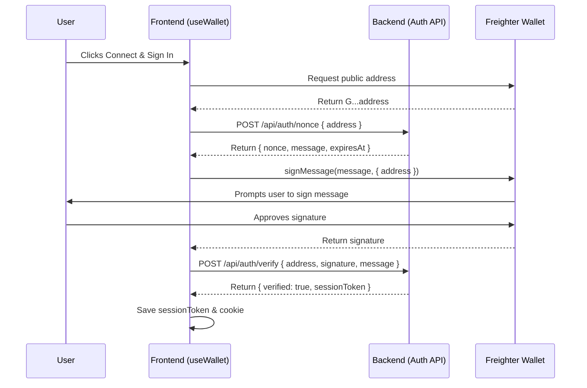

# Wallet Signature Authentication Handshake

This document describes the cryptographic authentication flow implemented in `src/hooks/useWallet.ts` using the Freighter browser extension to establish a secure session.

## Handshake Flow

The signature-based authentication protocol uses a three-step cryptographic handshake:



### 1. Request Nonce
The frontend makes a POST request to `/api/auth/nonce` with the user's public address:
```json
POST /api/auth/nonce
{
  "address": "GABCDEFGHIJKLMNOPQRSTUVWXYZ0123456789ABCDE"
}
```
The server generates a secure cryptographically random nonce, registers it in the temporary key-value store, and returns a formatted challenge message:
```json
{
  "success": true,
  "data": {
    "nonce": "c6204c3e800b4624",
    "message": "[CommitLabs Auth V2]\nDomain: commitlabs.org\nNonce: c6204c3e800b4624\nIssuedAt: 2026-06-26T20:00:00.000Z\nExpiresAt: 2026-06-26T20:05:00.000Z",
    "expiresAt": "2026-06-26T20:05:00.000Z"
  }
}
```

### 2. Sign Message
The frontend requests the user to sign the returned challenge message using Freighter:
```typescript
import { signMessage } from "@stellar/freighter-api";

const { signedMessage, error } = await signMessage(message, { address });
```
This opens the Freighter extension prompt. The user reviews the domain name and nonce, then signs the data.

### 3. Verify Signature
The frontend submits the signature back to the server:
```json
POST /api/auth/verify
{
  "address": "GABCDEFGHIJKLMNOPQRSTUVWXYZ0123456789ABCDE",
  "signature": "a5e8f4...",
  "message": "[CommitLabs Auth V2]\nDomain: commitlabs.org\nNonce: c6204c3e800b4624\nIssuedAt: 2026-06-26T20:00:00.000Z\nExpiresAt: 2026-06-26T20:05:00.000Z"
}
```
The backend:
- Validates that the message adheres to the `[CommitLabs Auth V2]` template and matches the server-configured domain.
- Validates that the challenge has not expired.
- Verifies the signature against the public key (`address`) using Ed25519 verification.
- Checks that the nonce matches the registered session challenge for the specified address, then deletes (consumes) the nonce.
- Returns a secure `sessionToken`.

---

## Security Considerations

### 1. Account-Switching Protection
If a user switches accounts within Freighter, or disconnects their wallet:
- The hook compares the current connected wallet address against the authenticated address stored during the handshake (`commitlabs.authAddress`).
- Upon mismatch or disconnection, the active session token, local storage keys, and cookie are instantly cleared to prevent unauthorized state-changing requests.

### 2. Plaintext Secrets Handling
To prevent leaks:
- The raw signature and nonces are handled in-memory and are never written to `localStorage`, `sessionStorage`, or logs.
- Disconnected wallets clean up all references.

### 3. Session Token Storage
Upon successful authentication, the `sessionToken` is written to:
- State for in-memory hook consumption.
- LocalStorage and SessionStorage under `commitlabs.sessionToken`, `commitlabs:sessionToken`, and `sessionToken` for backward compatibility with older page exports.
- A secure `session` cookie:
  ```typescript
  document.cookie = `session=${token}; path=/; SameSite=Lax; Secure`;
  ```
  This is required for backend route handlers that enforce cookie-based session verification.

### 4. Idempotency & Race Conditions
- Multiple simultaneous calls to `signIn()` are ignored if a sign-in process is already in progress (`authenticating === true`).
- In-flight fetch and signing errors are safely caught, clearing any partial credentials and populating `authError`.
